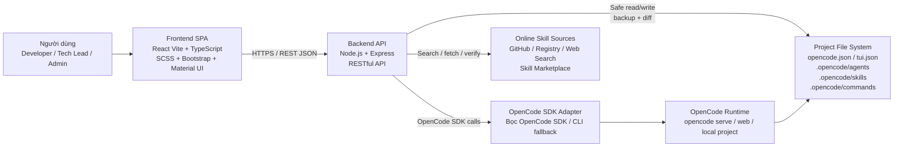
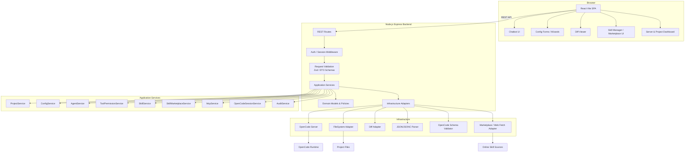
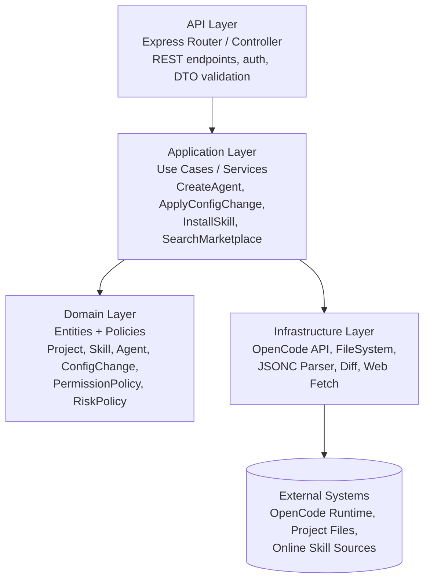
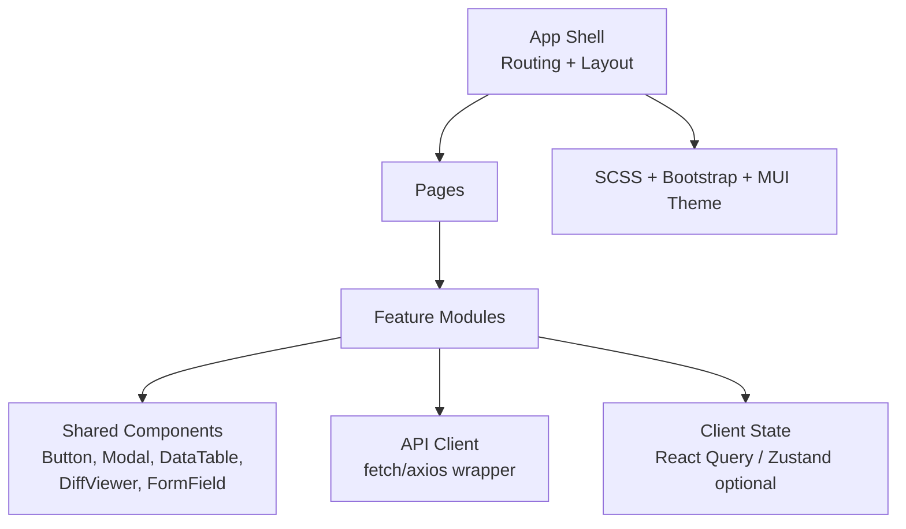
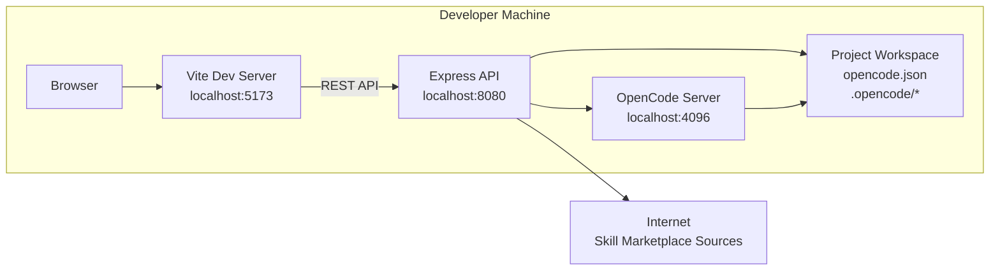
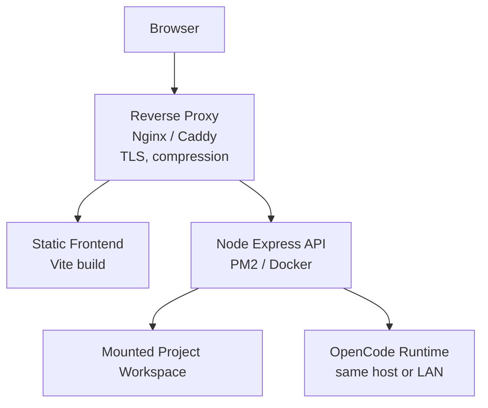

# ARCHITECTURE.md

# Thiết kế kiến trúc Pro Chatbot

<!-- TOC:START -->
## Mục lục

- [1. Mục tiêu kiến trúc](#1-mục-tiêu-kiến-trúc)
- [2. Architectural patterns](#2-architectural-patterns)
- [3. System context diagram](#3-system-context-diagram)
  - [Chú thích](#chú-thích)
- [4. Container / module diagram](#4-container-module-diagram)
- [5. Backend layered architecture](#5-backend-layered-architecture)
  - [Dependency rules](#dependency-rules)
- [6. Core application services](#6-core-application-services)
- [7. Config change pipeline](#7-config-change-pipeline)
  - [Risk levels](#risk-levels)
- [8. Skill Marketplace install flow](#8-skill-marketplace-install-flow)
- [9. Chatbot config automation flow](#9-chatbot-config-automation-flow)
- [10. Frontend architecture](#10-frontend-architecture)
  - [Frontend module list](#frontend-module-list)
- [11. Deployment architecture](#11-deployment-architecture)
  - [11.1 Local-first MVP](#111-local-first-mvp)
  - [11.2 Self-hosted deployment](#112-self-hosted-deployment)
- [12. Quality attributes and tactics](#13-quality-attributes-and-tactics)
- [13. Architecture decisions](#14-architecture-decisions)

<!-- TOC:END -->

## 1. Mục tiêu kiến trúc

**Pro Chatbot** là website chatbot đóng vai trò lớp giao diện và điều phối phía trên OpenCode. Hệ thống không thay thế OpenCode, mà cung cấp giao diện trực quan để người dùng quản lý project, server connection, model/provider, agent, tool/permission, MCP server, command, skill, Skill Marketplace, session và file cấu hình OpenCode.

Tech Stack:

| Lớp | Công nghệ |
|---|---|
| Language | TypeScript |
| Frontend | React Vite, SCSS, Bootstrap, Material UI |
| Backend | Node.js, Express, RESTful API, OpenCode SDK |
| Runtime data | OpenCode API server |

Current implementation notes:

- Backend API listens on port `8080` by default and is mounted under `/api`.
- Frontend dev server listens on port `5173` and proxies `/api` to `http://localhost:8080`.
- OpenCode server settings are read from `opencode.json` (`server.hostname`, `server.port`, `server.cors`) and are not duplicated in `backend/.env`.
- Runtime data comes from OpenCode whenever possible. The backend falls back to filesystem scans for local agents, skills, commands, config files, and git-derived dashboard context.
- There is no local database layer. Preview/apply records, backup metadata, skill overrides, marketplace cache, and audit logs are in-memory state. Backup files still persist under `.pro-chatbot/backups`.

Mục tiêu kiến trúc:

- Tách rõ frontend, backend, domain logic và infrastructure adapters.
- Không cho frontend ghi trực tiếp vào file cấu hình OpenCode.
- Mọi thay đổi cấu hình phải đi qua pipeline: read → parse → validate → diff → backup → apply → verify → audit.
- Dễ mở rộng theo module: Config, Agent, Tool/Permission, Skill, Marketplace, MCP, Command, Session, Audit.
- Ưu tiên local-first, nhưng có thể self-host bằng reverse proxy và mounted workspace.

---

## 2. Architectural patterns

| Pattern | Cách áp dụng |
|---|---|
| Client-Server | Browser/React là client; Express API là server. |
| Layered Architecture | Controller → Application Service → Domain Policy → Infrastructure Adapter. |
| Component-Based | Mỗi nhóm chức năng OpenCode được tách thành module riêng. |
| Pipe-and-Filter | Pipeline xử lý config và cài skill. |
| Adapter Pattern | Bọc OpenCode API, filesystem, diff engine và marketplace search. |
| Source-of-Truth Pattern | Dữ liệu runtime lấy từ OpenCode API thay vì mirror sang database cục bộ. |

---

## 3. System context diagram

### Chú thích

1. **Frontend không truy cập trực tiếp filesystem hoặc OpenCode runtime.**  
   Mọi thao tác đi qua Backend API để tránh ghi config sai, lộ secret hoặc bỏ qua validation.

2. **OpenCode API là source of truth của runtime data.**  
   Project, agent, skill, command và session được đọc trực tiếp từ OpenCode server. File cấu hình vẫn là source of truth cho nội dung local như `opencode.json`, `tui.json`, `.opencode/*`.

3. **OpenCode SDK Adapter là lớp chống phụ thuộc.**  
   Nếu OpenCode SDK/API thay đổi, chỉ adapter bị ảnh hưởng.

4. **Skill Marketplace chỉ tìm kiếm và đề xuất.**  
   Việc cài đặt skill phải qua preview, validate, diff và xác nhận.

---

## 4. Container / module diagram

---

## 5. Backend layered architecture

### Dependency rules

- Controller không đọc/ghi file trực tiếp.
- Service không phụ thuộc Express request/response.
- Domain policy không phụ thuộc Express hoặc OpenCode SDK.
- Infrastructure adapter là nơi duy nhất chạm vào filesystem, OpenCode API và network.
- Các hành động rủi ro cao phải đi qua `RiskPolicy`.

Current backend layout:

| Layer | Current files |
|---|---|
| App bootstrap | `backend/src/app.ts` configures CORS, JSON body parsing, static files, and route mounting. |
| Route registration | `backend/src/routes/api.ts` mounts API modules under `/api`; feature routes live in `backend/src/routes/api/*.routes.ts`. |
| Controllers | `backend/src/controllers/api/*.controller.ts` convert Express request/response to service calls and common envelopes. |
| Services | `backend/src/services/opencode-control.service.ts` contains the main feature logic; smaller re-export modules under `backend/src/services/opencode-control/*.service.ts` define module boundaries. |
| Runtime adapter | `backend/src/services/opencode-control/runtime.ts` handles OpenCode health, local server auto-start, request headers, and restart through `/global/dispose`. |
| State adapter | `backend/src/services/opencode-control/state-store.ts` builds current project state and stores volatile metadata in memory. |
| Frontend API client | `frontend/src/services/appDataService.ts` mirrors backend endpoints used by the UI. |

---

## 6. Core application services

| Service | Trách nhiệm |
|---|---|
| `ProjectService` | Quản lý project root, config path, workspace status. |
| `ServerConnectionService` | Lưu và test endpoint OpenCode server. |
| `ConfigService` | Đọc, parse, validate, diff, backup, apply config. |
| `AgentService` | CRUD agent, set default agent, phân biệt primary/subagent. |
| `ToolPermissionService` | Quản lý tool permission: `allow`, `ask`, `deny`, wildcard rules. |
| `SkillService` | Scan skill local/global/project, validate `SKILL.md`, enable/disable/import/export. |
| `SkillMarketplaceService` | Tìm skill online, cache kết quả, preview, verify nguồn, install flow. |
| `McpService` | Quản lý MCP local/remote, OAuth/header/env reference. |
| `CommandService` | CRUD custom command, preview template. |
| `OpenCodeSessionService` | Tạo/mở session OpenCode, gửi prompt nếu SDK/API hỗ trợ. |
| `AuditService` | Ghi lịch sử thao tác, diff, actor, thời gian, kết quả. |

---

## 7. Config change pipeline

```mermaid
flowchart LR
    A["User request<br/>Chatbot / Form"] 
    B["Intent Parser<br/>Map natural language<br/>to config operation"]
    C["Load Current Config<br/>global / project / tui / .opencode"]
    D["Normalize ChangeSet<br/>typed internal model"]
    E["Validate<br/>schema + semantic rules"]
    F["Risk Analysis<br/>bash/edit/write/secret/wildcard"]
    G["Generate Preview<br/>JSON/JSONC + diff"]
    H{"User confirms?"}
    I["Create Backup"]
    J["Atomic Write"]
    K["Verify OpenCode<br/>config/server check"]
    L["Audit Log"]
    M["Rollback Guide<br/>if failed"]

    A --> B --> C --> D --> E --> F --> G --> H
    H -- No --> L
    H -- Yes --> I --> J --> K --> L
    K -- Failed --> M --> L
```

### Risk levels

| Risk level | Ví dụ | Chính sách |
|---|---|---|
| `low` | Tạo read-only agent, đổi theme, xem skill. | Cho phép preview/apply sau xác nhận thường. |
| `medium` | Đổi model, thêm command, thêm MCP disabled. | Hiển thị cảnh báo tác động. |
| `high` | Bật `bash`, `edit`, `write`, wildcard permission, remote MCP, install skill online. | Yêu cầu xác nhận rõ ràng. |
| `critical` | Lưu secret thô, ghi outside workspace, tắt toàn bộ kiểm soát an toàn. | Mặc định block hoặc yêu cầu override admin. |

Implementation exception list:

| Operation | Current behavior | Required safeguard |
|---|---|---|
| Command create/delete | Writes/removes `.opencode/commands/:name.md` directly. | Audit entry; consider changing to preview/apply if command edits become high-risk. |
| Agent delete | Removes only agent files with a real file path. Built-in agents are read-only. | Backup before delete, audit, OpenCode restart. |
| Skill status/delete | Status is volatile; delete removes only project/user-global skill roots. | Backup directory before delete, audit, OpenCode restart. |
| MCP delete | Edits config directly to remove the MCP key. | Backup config, audit, OpenCode restart. |
| MCP marketplace install | Creates and applies a config patch immediately, then attempts runtime registration. | Persist env/file secret references only; never write plaintext API keys. |

---

## 8. Frontend architecture

### Frontend module list

Current routed pages are `chat`, `agents`, `permissions`, `skills`, `mcp`, `commands`, and `sessions`. Settings is a modal, not a standalone route. Dashboard/config/audit concepts are represented through app-state metrics, settings modal, detail/preview panels, and future route candidates.

| Feature | UI chính |
|---|---|
| Chatbot | Chat panel, composer model/agent typeahead, reasoning-aware message renderer, markdown table support, intent preview, confirmation dialog. |
| Config | Config tree, generated JSON preview, diff viewer. |
| Agent | Agent table, create/edit wizard, permission matrix. |
| Tool/Permission | Matrix view: tool × scope × allow/ask/deny. |
| Skill | Local skill list, skill detail, validation status. |
| Marketplace | Search box, filters, skill cards, preview modal, install flow. |
| MCP | Server list, connection status, add wizard. |
| Audit | Timeline, diff history, rollback action. |

---

## 9. Deployment architecture

### 9.1 Local-first MVP

### 9.2 Self-hosted deployment

---

## 10. Quality attributes and tactics

| Quality attribute | Tactic |
|---|---|
| Safety | Backend-only filesystem access, validate trước ghi, risk policy, không lưu secret thô. |
| Extensibility | Mỗi nhóm OpenCode là module riêng; Marketplace dùng source adapter. |
| Maintainability | Layered backend, DTO/schema chung, OpenCode SDK Adapter. |
| Rollbackability | Backup trước write, checksum, audit log, rollback endpoint. |
| Correctness | JSONC parser, schema validation, semantic validation, verify sau apply. |
| Performance | Lazy-load project config, pagination audit/skills, avoid duplicate runtime mirrors. |
| Portability | Node + OpenCode API chạy được trên Windows/macOS/Linux; path adapter theo OS. |
| Observability | Audit log, structured logs, health check, server status dashboard. |

---

## 11. Architecture decisions

| ID | Decision | Rationale |
|---|---|---|
| ADR-01 | Dùng React Vite SPA + Express REST API | Đơn giản, phù hợp MVP, dễ tách frontend/backend. |
| ADR-02 | Dùng layered backend | Tách controller, use case, domain, infrastructure; dễ test. |
| ADR-03 | Không dùng local database | Tránh shadow state; OpenCode API server là nguồn dữ liệu runtime duy nhất. |
| ADR-04 | Dùng OpenCode SDK Adapter | Giảm phụ thuộc trực tiếp vào SDK trong business logic. |
| ADR-05 | Config file vẫn là source of truth | Tôn trọng cơ chế gốc của OpenCode. |
| ADR-06 | Skill Marketplace chạy qua backend | Kiểm soát network, trust, validation, install path. |
| ADR-07 | Mọi ghi config đều cần diff + backup | Đáp ứng yêu cầu an toàn và rollback. |
| ADR-08 | Không dùng local database cho OpenCode UI | Giữ OpenCode runtime và filesystem là source of truth; volatile metadata đủ cho MVP nhưng phải được document rõ. |
| ADR-09 | Một số thao tác file-level có direct write | Command create/delete, agent delete, skill delete và MCP delete hiện có safeguard riêng; không được mở rộng direct write nếu chưa có lý do và kiểm thử. |

---
